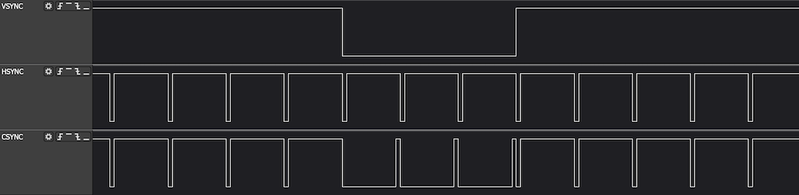
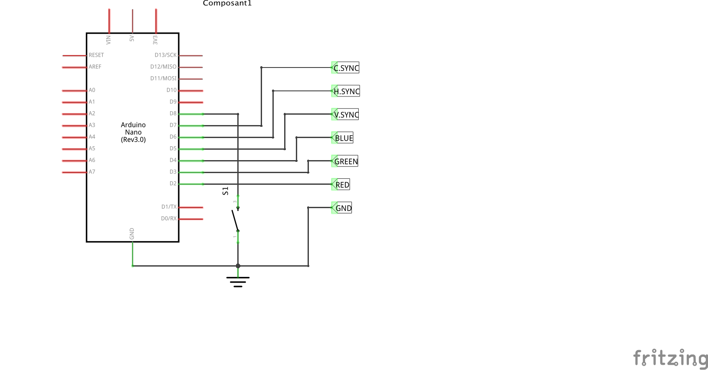

# Arduino RGB Pattern Generator

This are RGB Pattern Generator projects designed for Arduino boards.

## 15 KHz Pattern Generator

This generator is designed for 15 KHz Arcade Monitors. It is based on 16 MHz
Arduino boards like the Nano and the Uno ones (both have been tested).

Pure assembly source code is provided in 15khz_pattern_generator folder. Just
clone this folder, open it with the Arduino IDE and you are ready to go.

Particular care is taken to provide accurate syncing timings, based to the information provided on the MS-2931 Monitor Service Manual, as described by
@gc339 in a [very detailled WIP on gamoover]([http://](https://www.gamoover.net/Forums/index.php?topic=27188.0)). Thanks to him!

- Line sync pulse is 4.75 µs long. It is followed by a 6.45 µs back porch, then
  take the line draing during 49.17µs. After that is a 3.19µs front porch
  before the next line sync line pulse.
- Frame sync pulse is 3 line long. After that, 23 empty lines (vertical back
  porch) are sent before sending the 224 lines of the displayed image. Then
  come 13 blank lines (vertical front porch), before the next image is going to
  be generated.

Arduino outputs can be be wired directly to the Monitor or, if you prefer, via
a buffer (LS125, LS367, ...) in order to protect your Arduino.
C.SYNC signal combines both vertical and horizontal sync signals on a sigle
wire. With Arcade Monitors, the C.SYNC signal is enough. This is at least the
case with the popular Hantarex ones.

You can select the pattern one by on with the pushbutton S1.

At this step of the development, ony two patterns are provided : 8 colors
vertical bars and grid. More to come asap.

